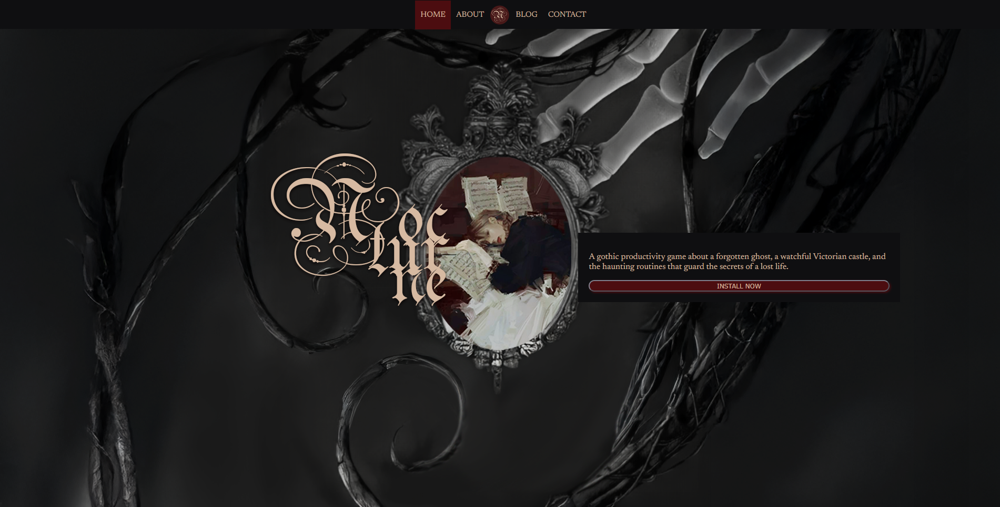

# Nocturne – Game Promo Website

<small>Small gothic promo site for a fictional game. Built for the Web Authoring assignment (deployment, markup, layout, responsiveness, accessibility).</small>

---
## 1. Deployment & How to Run

**Live (GitHub Pages)**  
- Home: https://adafarkosh.github.io/gamewebsite/  
- About: https://adafarkosh.github.io/gamewebsite/pages/about.html  
- Blog: https://adafarkosh.github.io/gamewebsite/pages/blog.html  
- Blog entry: https://adafarkosh.github.io/gamewebsite/pages/blog-entry.html  
- Contact: https://adafarkosh.github.io/gamewebsite/pages/contact.html  

**Locally**

1. Repo: https://github.com/adafarkosh/gamewebsite  
2. Download or `git clone`  
3. Open `index.html` in a browser (no build tools or server needed).

The site uses percentage widths and media queries and remains readable on small screens (phones/tablets).

---

## 2. Markup, Styles & Structure

**Tech**

- HTML5 + CSS3 only (no JavaScript)
- Google Fonts:  
  - `UnifrakturMaguntia` – gothic display for headings and logo  
  - `Newsreader` – body text, navigation and UI labels

**Key files**

- Home: [`index.html`](https://github.com/adafarkosh/gamewebsite/blob/main/index.html)  
- About: [`pages/about.html`](https://github.com/adafarkosh/gamewebsite/blob/main/pages/about.html)  
- Blog: [`pages/blog.html`](https://github.com/adafarkosh/gamewebsite/blob/main/pages/blog.html)  
- Blog entry: [`pages/blog-entry.html`](https://github.com/adafarkosh/gamewebsite/blob/main/pages/blog-entry.html)  
- Contact: [`pages/contact.html`](https://github.com/adafarkosh/gamewebsite/blob/main/pages/contact.html)  
- Styles: [`style/style.css`](https://github.com/adafarkosh/gamewebsite/blob/main/style/style.css)  
- Sitemap (XML): [`sitemap.xml`](https://github.com/adafarkosh/gamewebsite/blob/main/sitemap.xml)

Semantic HTML is used for headings, paragraphs, lists, links and the contact table (`<table>`, `<tr>`, `<th>`, `<td>`).  
Navigation is a `<ul><li><a>` list styled as a fixed menu.

---

## 3. Design, Layout & Responsiveness

**Layout**

- Large hero background set on a `.background` container (`height: 100vh`, `background-size: cover`).
- Overlays (intro text, blog panel, contact card) are absolutely positioned inside this container.
- Flexbox is used to:
  - Center the fixed menu (`.menu ul`)
  - Stack content inside panels (`flex-direction: column`, `gap`)

**Typography & colour**

- Typography system is planned in [`_planing/typography.png`](https://github.com/adafarkosh/gamewebsite/blob/main/_planing/typography.png):
  - `UnifrakturMaguntia` is used for major headings (game title, “Blog”, “Contact us”) and logo-style text.
  - `Newsreader` is used as understated body text for paragraphs, navigation, buttons and table content.
- Dark theme with light text (`#EFCFB4`) on near-black backgrounds for contrast.
- Burgundy accents (`#5b1517` / `#550E12`) for active navigation, blog buttons, and the contact table frame/header.

**Responsiveness**

- Panels use percentage widths and offsets (`width: 30%`, `right: 10%`, etc.) so they scale with the viewport.
- Media queries (e.g. `@media (max-width: 600px)`) reduce font size and padding for tables and panels so the layout fits smaller screens comfortably.

---

## 4. Interactivity (CSS Only)

- **Navigation:** hover colour change; active page highlighted with burgundy background.
- **Buttons (e.g. “INSTALL NOW”):** colour + scale transition on hover/active, with box shadow feedback.
- **Blog list:** each entry is a link in a red bar, darkening on hover.
- **Contact table:** full row highlight with `tr:hover td`.

All interaction is implemented using CSS pseudo-classes and transitions (no JS, no keyframes).

---

## 5. Accessibility & Performance

- Nav built from `<ul><li><a>…</a></li></ul>` – keyboard and screen-reader friendly.
- Contact list uses `<th>` for column headers; rows remain readable without CSS.
- Hero image is decorative background; functional images (e.g. logo) can use `alt` text.
- Strong colour contrast between text and background.
- Lightweight: one custom stylesheet, static images in [`/images`](https://github.com/adafarkosh/gamewebsite/tree/main/images), no JS libraries or build pipeline.

---

## 6. Planning & Evidence

All planning artefacts are in the `_planing` folder:  
https://github.com/adafarkosh/gamewebsite/tree/main/_planing  

Includes:

- Grid / wireframes: `_planing/1_grid/`
- Draft layouts: `_planing/2_draft/`
- Colour scheme: `_planing/colourscheme.png`
- Typography pairing for headings/body (UnifrakturMaguntia + Newsreader):  
  [`_planing/typography.png`](https://github.com/adafarkosh/gamewebsite/blob/main/_planing/typography.png)
- Sitemap sketch and text notes: `_planing/sitemap.png`, `_planing/sitemap.txt`

These files document the design process (layout, colour, typography, sitemap) before implementation.
